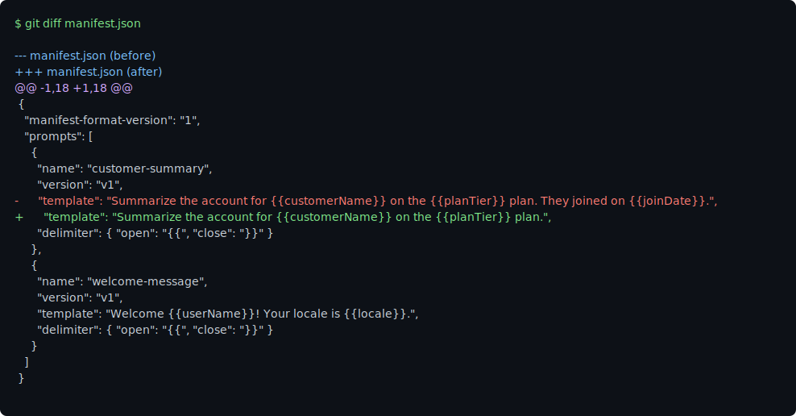
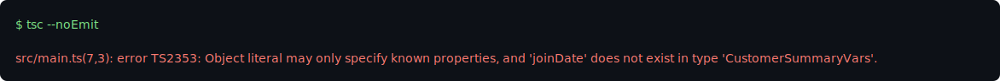

# PromptRegistry

An OSS TypeScript SDK + CLI that turns a static prompt manifest into typed, greppable named imports with lockfile-gated integrity.

The wedge is two things together: a typed `pull` (each prompt entry is emitted as a runtime `.ts` with a named `XxxVars` type alias, so a missing variable is a normal `tsc` error that names the prompt) and lockfile-gated **Placeholder** integrity (the manifest hash is committed in `prompt-lock.json`, and `promptregistry check` fails if the remote was edited without a version bump). Built on the [promptkit](https://tprompt.pages.dev/) tagged-template primitive — see [promptkit's CONTEXT.md](./context/promptkit-foundation/CONTEXT.md) for the canonical vocabulary (Placeholder, Variables object, Compiled template, Parser). **Non-goals:** no hosted UI, no eval running, no migration importers, no template logic — variables only.

A PM edits the remote manifest and removes a variable:



The next `tsc --noEmit` on a consumer's repo names the offending prompt and the removed variable:



## What it does

1. **Static manifest** — a JSON file hosted on GitHub raw, a release asset, or a public bucket. Each entry has a name, version, template string, and delimiter.
2. **`promptregistry codegen`** — fetches the manifest, emits one runtime `.ts` per prompt (typed via a named `XxxVars` alias), and writes a `registry.ts` barrel with named exports.
3. **Lockfile integrity** — `prompt-lock.json` pins each prompt to its content hash. `promptregistry check` fails if the remote was edited without a version bump.
4. **Human tsc errors** — because each prompt's variables are exported as a named type, tsc's native error already calls out the prompt: `... not assignable to parameter of type 'CustomerSummaryVars'`. `promptregistry check --tsc` adds an extra pass that rewrites diagnostics from the generated files themselves.

## Quick start

```bash
npm install promptregistry
```

Create a `manifest.json`:

```json
{
  "manifest-format-version": "1",
  "prompts": [
    {
      "name": "customer-summary",
      "version": "v1",
      "template": "Summarize the account for {{customerName}} on the {{planTier}} plan.",
      "delimiter": { "open": "{{", "close": "}}" }
    }
  ]
}
```

Generate types:

```bash
npx promptregistry codegen --manifest ./manifest.json --out ./prompts/.generated
```

Import and use (NodeNext requires the `.js` extension on the source-side import):

```ts
import { customerSummary } from './prompts/.generated/registry.js'

// Missing a variable? tsc catches it before it reaches the model.
const output = customerSummary.with({
  customerName: 'Ada',
  planTier: 'Pro',
})
```

Wire into your build script:

```json
{
  "scripts": {
    "typecheck": "promptregistry check && tsc --noEmit"
  }
}
```

## Relationship to promptkit

PromptRegistry is built on the [promptkit](https://tprompt.pages.dev/) tagged-template primitive and reuses promptkit's vocabulary verbatim — see [promptkit's CONTEXT.md](./context/promptkit-foundation/CONTEXT.md) for the canonical definitions of **Placeholder**, **Variables object**, **Compiled template**, and **Parser**. PromptRegistry adds the operational layer on top: a Manifest as the source of truth, a typed `pull` via codegen, and a Lockfile-backed integrity gate. The package does not redefine those promptkit terms; if a section reads as if it does, file a bug.

## API reference

See [docs/api.md](./docs/api.md) for the manifest schema, pin grammar, lockfile shape, generated module shape, and per-command CLI reference.

## CLI commands

| Command | Purpose |
|---------|---------|
| `promptregistry codegen` | Generate runtime `.ts` files and `registry.ts` from the manifest |
| `promptregistry check` | Cross-check manifest, lockfile, and generated files |
| `promptregistry check --tsc` | Run `tsc --noEmit` and rewrite diagnostics |
| `promptregistry lock` | Write `prompt-lock.json` from the current manifest |
| `promptregistry init` | Scaffold manifest from existing `prompt()` call-sites |

## Configuration

Create `promptregistry.config.json`:

```json
{
  "manifestUrl": "https://example.com/manifest.json",
  "srcRoots": ["./src"],
  "outDir": "./prompts/.generated"
}
```

Or pass flags: `--manifest <url>`, `--src <dirs>`, `--out <dir>`.

## Non-goals

- No hosted web UI in v1
- No eval running — use promptfoo for that
- No migration importers from Langfuse or PromptLayer
- No template logic (`{{#if}}`, loops) — variables only

## License

MIT
